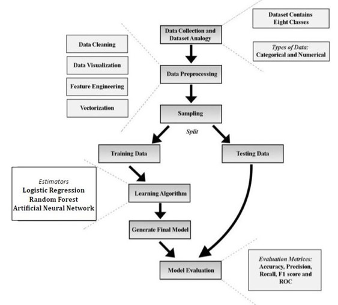

# Anomaly Detection in IoT sensors using Machine Learning and Deep Learning
Under the guidance of Professor **Dr. Kishor Sarawadekar**, ECE IIT(BHU)

## Team Members:
1) Debasish Chakraborty  
2) Sakshi Gulati 
3) Suryansh Singh 

## Introduction:
We present our **Machine Learning** model to detect and predict attack/anomaly in IOT sensors and  also we perform a comparative study to find the best approach among various Machine Learning techniques and models by comparing them on the basis of Accuracy, Prediction, and ROC.  

## Dataset Used:
[Dataset](https://www.kaggle.com/francoisxa/ds2ostraffictraces)

## Flow Chart:

